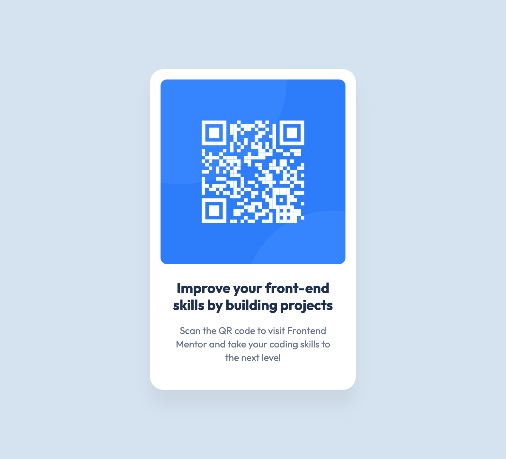

# Frontend Mentor - QR code component solution

This is a solution to the [QR code component challenge on Frontend Mentor](https://www.frontendmentor.io/challenges/qr-code-component-iux_sIO_H). Frontend Mentor challenges help you improve your coding skills by building realistic projects.

## Table of contents

- [Overview](#overview)
  - [Screenshot](#screenshot)
  - [Links](#links)
- [My process](#my-process)
  - [Built with](#built-with)
  - [Why do this challenge](#why-do-this-challenge)
- [Author](#author)

## Overview

### Screenshot

### Links

- Solution URL: [Add solution URL here](https://your-solution-url.com)
- Live Site URL: [Add live site URL here](https://your-live-site-url.com)

## My process

### Built with

- Semantic HTML5 markup
- CSS custom properties
- CSS Grid (for centering in the page)
- CSS nesting
- Mobile-first workflow

### Why do this challenge

This is one of the first challenges many people will encounter when signing up for Frontend Mentors. While relatively simple in nature, it benefits from exploring the "card" pattern, which is used in a large variety of development work.

## Author

- Frontend Mentor - [@dave-cross](https://www.frontendmentor.io/profile/dave-cross)
